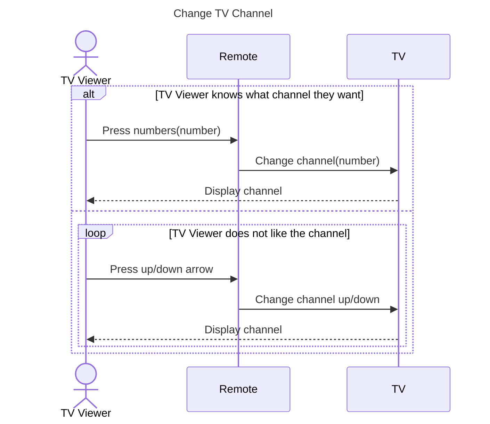

# 1.3.6 – UML Sequence Diagram

## 개요

- 시퀀스 다이어그램(sequence diagram)은 프로그램의 객체들이 특정 작업을 완수하기 위해 서로 어떻게 상호작용하는지 보여주는 UML 다이어그램이다.
- 사람과 사람 사이에 오가는 메시지를 따라가는 대화 지도(map of conversations)에 비유할 수 있다.
- 역할 상자(box), 생명선(lifeline), 메시지 화살표(arrow)로 구성되며, 대안(alt) 상자와 루프(loop) 상자로 조건 분기와 반복도 표현한다.

## 내용

### 시퀀스 다이어그램이란

- 시퀀스 다이어그램은 팀에게 프로그램의 객체들이 작업을 완수하기 위해 어떻게 상호작용하는지 보여준다.
- **햄버거 주문 비유**: 손님이 패스트푸드점에서 버거를 주문하면 → 손님이 캐셔에게 주문을 말하고 → 캐셔가 주방의 셰프에게 주문을 전달하고 → 셰프가 버거를 조리해 캐셔에게 주고 → 캐셔가 손님에게 건넨다. 손님이 버거를 받기까지 이 모든 상호작용이 필요했다. 시스템의 객체들도 이런 식으로 상호작용해 작업을 완수한다.
- 시퀀스 다이어그램도 UML 다이어그램의 한 종류이므로, 객체와 기본적인 UML 클래스 다이어그램(class diagram)을 잘 이해해야 한다. 시스템을 클래스로 분해할 줄 아는 것이 의미 있는 시퀀스 다이어그램을 만드는 데 필수적이다.

### 구성 요소

- **역할 상자(box)**: 객체가 수행하는 역할(role)을 상자로 나타낸다. 역할은 보통 그 객체의 클래스 이름으로 라벨을 붙인다.
- **생명선(lifeline)**: 시간이 흐르는 동안의 객체를 나타내는 수직 점선. 객체에서 아래로 뻗는 파선(dashed line)으로 그린다.
- **화살표(arrow)**: 한 객체에서 다른 객체로 보내는 메시지를 나타낸다.
  - 메시지 전송: **실선 화살표(solid line arrow)** — 보내는 쪽에서 받는 쪽으로.
  - 데이터 반환 및 제어 반환: **점선 화살표(dotted line arrow)**.
- **액터(actor)**: 객체를 사용하거나 상호작용하는 사람은 막대 인간(stick figure)으로 그린다.
- **활성화(activation)**: 객체가 메시지를 보내거나, 받거나, 기다릴 때 그 객체는 활성화된다. 생명선 위의 작은 직사각형으로 표시한다.

### TV 채널 변경 예시로 다이어그램 만들기

1. **전체 상자**: 전체 과정을 감싸는 큰 상자를 그려 하나의 활동 시퀀스임을 나타낸다. 시퀀스 다이어그램은 내부에 다른 시퀀스 다이어그램을 포함할 수 있다. 예를 들어 ATM의 시퀀스 다이어그램에서 출금(withdrawal)과 입금(deposit)은 서로 다른 시퀀스인데, 한 과정에서 둘 다 하고 싶을 수 있으므로 큰 시퀀스 안에 두 개의 작은 시퀀스를 넣는다.
2. **제목**: 왼쪽 위 모서리에 의미 있는 제목을 붙인다. 팀이 개발 참고 자료로 보게 되므로 제목이 의미 있어야 한다. 여기서는 "Change TV Channel".
3. **객체 배치**: 이 작업에서 중요한 객체들을 그린다. 깔끔하게 하려면 상호작용하는 순서대로 왼쪽에서 오른쪽으로 배치한다. TV 시청자(TV viewer)가 전체 과정을 시작하고, 리모컨(remote)을 사용하고, 리모컨이 TV와 상호작용하므로 TV viewer → remote → TV 순으로 그린다. TV viewer는 액터이므로 막대 인간으로, 나머지는 라벨 붙은 상자로 그린다.
4. **생명선**: 각 객체에서 아래로 파선을 그린다.
5. **메시지**: TV가 이미 켜져 있고 시청자가 채널을 바꾸고 싶다고 하자.
   - 시청자가 리모컨의 숫자를 누른다 → TV viewer와 remote가 활성화되고, TV viewer에서 remote로 실선 화살표를 그리고 `Press numbers(number)`로 라벨.
   - 리모컨이 TV에 채널 변경 메시지를 보낸다 → `Change channel(number)` 실선 화살표. TV 객체도 활성화되므로 TV 생명선에 작은 직사각형을 추가한다. TV는 처음부터 활성화된 것이 아니므로 직사각형을 생명선의 조금 아래에서 시작해 나중에 활성화됐음을 나타낸다.
   - TV가 채널을 바꾸고 시청자가 화면에서 이를 본다 → 제어의 반환(returning of control)이므로 TV에서 TV viewer로 점선 화살표. 이 상호작용은 TV와 시청자에게만 영향을 주므로 remote의 활성 직사각형은 여기까지 연장하지 않는다.

### 대안(alt)과 루프(loop)

- 소프트웨어를 설계하다 보면 시퀀스 다이어그램이 훨씬 복잡해질 수 있고, 루프와 대안 프로세스(alternative process)도 표현할 수 있다.
- **alt 상자**: 조건이 참일 때 일어나는 활동 시퀀스를 상자로 감싸고 오른쪽 위에 `alt`라고 라벨을 붙인다. 앞서 그린 시퀀스는 "TV 시청자가 원하는 채널을 아는 경우"라는 조건을 붙인다.
- **else**: 시청자가 원하는 채널을 모른다면 다른 시퀀스가 일어난다. 이전 시퀀스 아래에 `else` 조건(다른 모든 대안이 거짓일 때 발생)으로 그 시퀀스를 그린다.
- **loop 상자**: 채널 서핑 시퀀스는 루프를 포함하므로 상자 오른쪽 위에 `loop` 라벨을 붙이고, 라벨 바로 아래에 루프의 조건문을 적는다. 조건이 참이면 루프를 반복한다. 여기서는 "시청자가 보고 있는 채널이 마음에 들지 않는 동안" 반복한다.
  - 시청자가 리모컨의 위/아래 버튼을 눌러 채널을 탐색한다 → 리모컨으로 메시지 전송 → 리모컨이 TV로 메시지 전송 → 처음 시퀀스처럼 TV가 채널을 바꿔 시청자에게 보여준다.

### 시퀀스 다이어그램의 용도

- 개발팀이 프로그래밍을 시작하기 전의 계획 도구로 흔히 사용된다.
- 시스템이 어떻게 설계되었는지 다른 사람에게 보여줄 때 사용된다.
- 작성해야 할 함수(function)를 파악하는 데 도움이 된다.
- 미처 보지 못했던 시스템의 문제를 발견하는 데도 도움이 될 수 있다.

## 예시

강의에서 단계별로 그린 "Change TV Channel" 시퀀스를 다이어그램으로 정리한 것이다.

- 실선 화살표는 메시지 전송, 점선 화살표는 데이터·제어의 반환이다.
- `alt` 상자는 조건이 참일 때의 시퀀스, `else`는 다른 모든 대안이 거짓일 때, `loop` 상자는 조건이 참인 동안 반복되는 시퀀스를 나타낸다.

## 요약

- 시퀀스 다이어그램은 객체들이 특정 작업을 완수하기 위해 주고받는 메시지를 시간 순서로 보여준다.
- 구성 요소: 역할 상자(클래스 이름 라벨), 생명선(수직 파선), 실선 화살표(메시지 전송), 점선 화살표(반환), 활성화 직사각형, 액터(막대 인간).
- 객체는 상호작용 순서대로 왼쪽에서 오른쪽으로 배치하고, 제목은 의미 있게 붙인다.
- `alt`/`else` 상자로 조건 분기를, `loop` 상자로 반복을 표현한다.
- 개발 전 계획 도구, 설계 공유, 필요한 함수 파악, 문제 발견에 유용하다.
