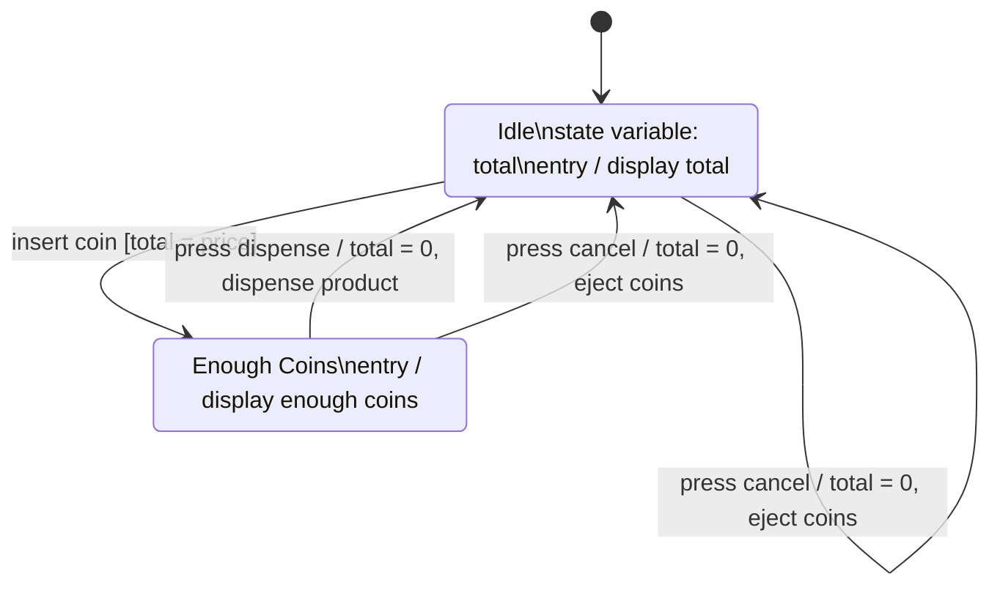

# 1.3.7 – UML State Diagram

## 개요

- 상태 다이어그램(state diagram)은 이벤트(event)가 발생할 때 시스템이나 객체가 어떻게 행동하고 반응하는지 기술하는 기법이다.
- 상태(state)를 노드로, 상태 간 전이(transition)를 화살표로 표현하며, 각 상태는 상태 이름·상태 변수·활동(entry/exit/do)을 가질 수 있다.
- 자판기(vending machine) 예시로 시작 상태, 전이의 이벤트·조건·액션, 종료(termination)까지 다이어그램 작성법을 익힌다.

## 내용

### 상태 다이어그램의 기본 개념

- 상태 다이어그램은 이벤트가 발생했을 때 시스템이 어떻게 행동하는지 기록하는 기법이다.
- **사람의 감정 상태 예시**: 어떤 사람이 행복(happy)·슬픔(sad)·분노(angry)라는 세 감정 상태를 가진다고 하자. 상태는 노드로 그리고, 채워진 원(filled circle)으로 시작 상태(start state)를 표시한다. 이 사람이 행복하게 하루를 시작했는데, 탁자에 발가락을 부딪히면 happy → angry로 상태가 바뀌고, 화가 난 상태에서 밖에 비가 오는 것을 보면 angry → sad로 바뀐다. 상태 간 전이는 이벤트를 나타내는 화살표로 그린다.
- 상태 다이어그램은 시스템이나 객체의 상태를 따라가며, 이벤트가 발생할 때 상태 사이의 변화를 보여준다.
- 상태 다이어그램은 단일 객체를 기술하며, 그 객체가 시스템의 일련의 이벤트에 어떻게 반응해 행동하는지 보여줄 수 있다.

### 상태(state)란

- 상태는 특정 시점에 객체가 존재하는 방식이며, 객체의 상태는 그 **속성(attribute)들의 값**으로 결정된다.
- **자동차 예시**: 자동변속기 자동차는 주차(park), 후진(reverse), 중립(neutral), 주행(drive) 상태를 가질 수 있다. 후진 상태일 때는 뒤로만 움직일 수 있고, 앞으로 가려면 상태를 바꿔야 한다.
- 객체가 특정 상태에 있을 때는 특정한 방식으로 행동하거나 속성이 특정 값으로 설정된다.

### 상태의 세 구성 요소

상태는 모서리가 둥근 직사각형(rounded rectangle)으로 그리며, 세 가지 중요한 부분을 가진다.

- **상태 이름(state name)**: 모든 상태는 최소한 이름을 가져야 하며, 의미 있는 이름이어야 한다. 예: 후진 중인 차는 `reverse`, 대기 중인 자판기는 `idle`.
- **상태 변수(state variable)**: 그 상태와 관련된 데이터. 예: 강의(course) 객체라면 등록 학생 수가 관련 변수이고, 이 변수가 정원에 도달하면 `full` 상태가 된다.
- **활동(activities)**: 특정 상태에 있을 때 수행되는 동작으로, 상태의 아래쪽에 표시한다. 세 종류가 있다.
  - **entry**: 다른 상태에서 이 상태로 막 들어올 때 발생하는 동작.
  - **exit**: 이 상태를 벗어나 다른 상태로 갈 때 발생하는 동작.
  - **do**: 그 상태에 있는 동안 한 번 또는 여러 번 발생하는 동작.
  - **알람 시계 예시**: 종을 쓰는 전통적 알람 시계가 울림(ringing) 상태에 들어갈 때 스프링을 풀어 종을 울리는 것이 entry 활동, 울림 상태를 떠날 때 스프링을 다시 잠그는 것이 exit 활동, 울리는 상태에 있는 동안 계속 종을 울리는 것이 do 활동이다.

### 전이(transition)

- 상태를 바꿀 수 있는 이벤트가 상태 사이의 전이에 라벨을 붙이며, 전이는 한 상태에서 다른 상태로 향하는 화살표로 그린다.
- 전이 화살표는 항상 **이벤트(event)** 를 가지며, **가드 조건(guard condition)** 과 **액션(action)** 을 가질 수 있다. 이벤트가 발생하고 조건이 참이면 그 상태에서 전이와 액션이 일어난다.
- **온라인 시험 예시**: 시험이 `in progress`에서 `submitted` 상태로 가려면 — 이벤트: 제출 버튼 클릭, 조건: 제출일이 마감일 이전, 액션: 시험 제출.

### 자판기(vending machine) 상태 다이어그램 만들기

1. 채워진 원으로 시작을 표시한다. 자판기는 동전 투입을 기다리는 `idle` 상태에서 시작한다.
2. `idle` 상태에 들어오면 항상 지금까지 투입된 동전의 합계를 표시한다. 상태 변수는 `total`, entry 활동은 `display total`.
3. **동전 투입(합계 < 가격)**: idle 상태에서 동전을 넣었는데 합계가 상품 가격보다 작으면 — idle로 되돌아오는 루프 전이. 이벤트 `insert coin`, 조건 `total < price`, 액션 `display insert more coins`.
4. **동전 투입(합계 = 가격)**: 합계가 상품 가격과 같아지면 — 새 상태 `enough coins`로 전이. 이벤트 `insert coin`, 조건 `total = price`. `enough coins`의 entry 액션은 `display enough coins`.
5. **배출 버튼**: `enough coins` 상태에서 배출(dispense) 버튼을 누르면 상품을 하나 내보내야 한다 — `enough coins`에서 idle로 전이. 이벤트 `press dispense`, 액션 `total = 0, dispense product`.
6. **취소 버튼**: 어느 상태에서든 취소 버튼을 누르면 투입한 동전을 모두 반환해야 한다 — 두 상태에서 idle로 향하는 두 전이. 이벤트 `press cancel`, 액션 `total = 0, eject coins`.

### 종료(termination)

- 종료는 객체가 파괴되거나 프로세스가 완료됨을 나타내며, 원 안에 채워진 원이 있는 기호로 그린다.
- 예: 은행 기계(bank machine)가 과정 끝에 카드를 반환하고 종료로 끝나는 것을 표현할 수 있다.
- 자판기처럼 계속 실행되는 시스템은 종료가 없을 수도 있다.

### 상태 다이어그램의 용도

- 시스템이나 단일 객체의 행동을 기술하는 데 유용하다.
- 객체의 생애 동안 발생할 수 있는 이벤트(예: 다양한 사용자 입력)와, 그때 객체가 어떻게 행동해야 하는지(조건 확인, 액션 수행)를 파악하는 데 도움을 준다.
- 시스템의 문제를 찾는 데도 도움이 된다. 예를 들어 자판기에서 주문 취소를 표현하는 것을 잊었다면 소스 코드보다 상태 다이어그램에서 더 쉽게 발견할 수 있다. 계획하지 못한 조건을 발견할 수도 있다.
- 테스트 작성에도 도움이 된다. 시스템의 여러 상태를 알면 테스트가 완전하고 올바른지 확인할 수 있다.

## 예시

강의에서 만든 자판기 상태 다이어그램을 정리한 것이다.

- 표기: `이벤트 [가드 조건] / 액션`.
- 자판기는 계속 실행되는 시스템이므로 종료(termination) 노드가 없다.

## 요약

- 상태 다이어그램은 이벤트에 반응해 변화하는 객체의 상태를 그려 객체의 행동을 기술한다.
- 상태는 속성 값으로 결정되며, 상태 이름·상태 변수·활동(entry/exit/do)으로 구성된다.
- 전이 화살표는 항상 이벤트를 가지며 가드 조건과 액션을 가질 수 있다: `이벤트 [조건] / 액션`.
- 시작은 채워진 원, 종료는 원 안의 채워진 원으로 표시하며, 계속 실행되는 시스템은 종료가 없을 수 있다.
- 상태 다이어그램은 설계 문제 발견과 완전하고 올바른 테스트 작성에 도움이 된다.
