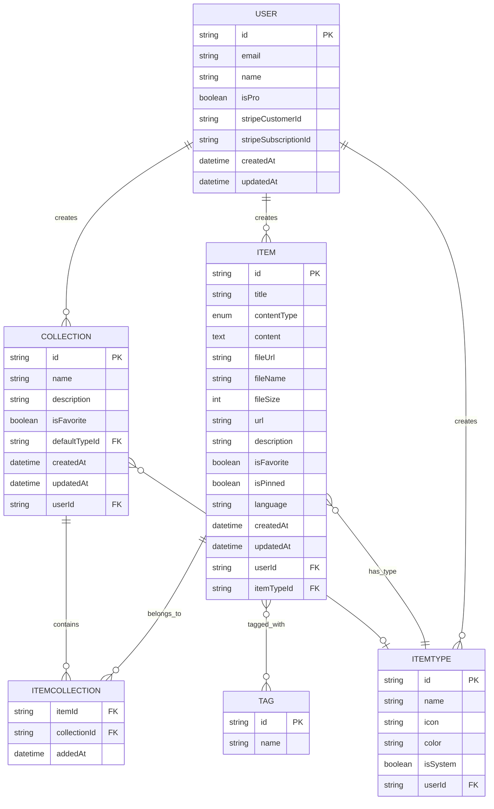
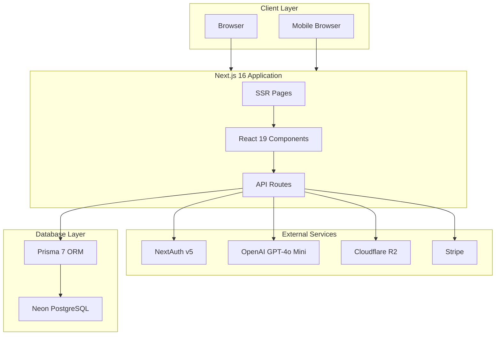
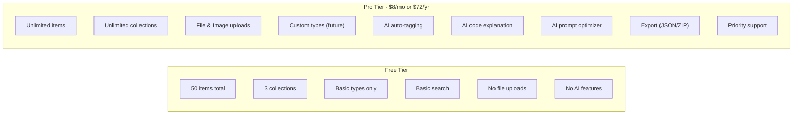

# DevStash - 프로젝트 개요(Project Overview)

> 원문 [project-overview.md](project-overview.md)의 한국어 번역본입니다.

> 개발자 지식과 리소스를 위한 통합 허브(unified hub)

---

## 📋 목차(Table of Contents)

- [Problem Statement](#-problem-statement)
- [Target Users](#-target-users)
- [Features](#-features)
- [Data Architecture](#-data-architecture)
- [Tech Stack](#-tech-stack)
- [Monetization](#-monetization)
- [UI/UX Guidelines](#-uiux-guidelines)

---

## 🎯 문제 정의(Problem Statement)

개발자는 필수 자료를 여러 도구와 위치에 흩어진 채로 관리한다:

| 리소스        | 흔한 위치                |
| ------------- | ------------------------ |
| Code snippets | VS Code, Notion, Gists   |
| AI prompts    | 채팅 기록                |
| Context files | 프로젝트 안에 묻혀 있음  |
| Useful links  | 브라우저 북마크          |
| Documentation | 아무 폴더                |
| Commands      | .txt 파일, bash 히스토리 |
| Templates     | GitHub Gists             |

**결과:** 컨텍스트 전환(context switching), 지식 유실, 일관성 없는 워크플로.

**해결책:** DevStash는 모든 개발자 지식과 리소스를 위한 하나의 빠르고, 검색 가능하며, AI로 강화된 허브를 제공한다.

---

## 👥 대상 사용자(Target Users)

| 사용자 유형                    | 주요 니즈                                          |
| ------------------------------ | -------------------------------------------------- |
| **Everyday Developer**         | 스니펫, 프롬프트, 명령어, 링크에 빠르게 접근        |
| **AI-First Developer**         | 프롬프트, 컨텍스트, 워크플로, 시스템 메시지 저장    |
| **Content Creator / Educator** | 코드 블록, 설명, 강의 노트 저장                     |
| **Full-Stack Builder**         | 패턴, 보일러플레이트, API 예제 수집                 |

---

## ✨ 기능(Features)

### A. 아이템과 아이템 타입(Items & Item Types)

아이템(item)은 DevStash의 핵심 단위다. 각 아이템은 동작과 외형을 결정하는 타입(type)을 가진다.

#### 시스템 타입(System Types, 변경 불가)

| 타입       | 아이콘        | 색상                | 콘텐츠 타입  | 라우트            |
| ---------- | ------------ | ------------------- | ------------ | ----------------- |
| 🔷 Snippet | `Code`       | `#3b82f6` (blue)    | Text         | `/items/snippets` |
| 🟣 Prompt  | `Sparkles`   | `#8b5cf6` (purple)  | Text         | `/items/prompts`  |
| 🟠 Command | `Terminal`   | `#f97316` (orange)  | Text         | `/items/commands` |
| 🟡 Note    | `StickyNote` | `#fde047` (yellow)  | Text         | `/items/notes`    |
| ⚫ File    | `File`       | `#6b7280` (gray)    | File         | `/items/files`    |
| 🩷 Image   | `Image`      | `#ec4899` (pink)    | File         | `/items/images`   |
| 🟢 Link    | `Link`       | `#10b981` (emerald) | URL          | `/items/links`    |

> **참고:** File 및 Image 타입은 Pro 전용 기능이다.

### B. 컬렉션(Collections)

사용자는 아이템을 컬렉션(collection)으로 정리할 수 있다. 아이템은 컬렉션과 다대다(many-to-many) 관계를 지원한다.

**예시:**

- React Patterns (snippets, notes)
- Context Files (files)
- Python Snippets (snippets)
- Interview Prep (mixed types)

### C. 검색(Search)

다음 전반에 대한 강력한 검색:

- 콘텐츠(Content)
- 태그(Tags)
- 제목(Titles)
- 타입(Types)

### D. 인증(Authentication)

- 이메일/비밀번호 인증
- GitHub OAuth 로그인
- NextAuth v5 기반

### E. 핵심 기능(Core Features)

- ⭐ 컬렉션 및 아이템 즐겨찾기
- 📌 아이템을 상단에 고정(Pin)
- 🕐 최근 사용한 아이템
- 📥 파일에서 코드 가져오기(Import)
- ✍️ 텍스트 타입용 마크다운 에디터(Markdown editor)
- 📤 파일 타입용 파일 업로드
- 💾 데이터 내보내기(JSON/ZIP)
- 🌙 다크 모드(기본값)
- 🏷️ 다중 컬렉션 아이템 할당
- 👁️ 아이템의 컬렉션 소속 보기

### F. AI 기능(AI Features, Pro 전용)

- 🤖 AI 자동 태그 제안
- 📝 AI 요약
- 💡 AI "Explain This Code"
- ⚡ 프롬프트 최적화(Prompt optimizer)

---

## 🗄️ 데이터 아키텍처(Data Architecture)

### 엔터티 관계 다이어그램(Entity Relationship Diagram)



### Prisma 스키마(Prisma Schema)

```prisma
// prisma/schema.prisma

generator client {
  provider = "prisma-client-js"
}

datasource db {
  provider = "postgresql"
  url      = env("DATABASE_URL")
}

// ============================================
// USER
// ============================================
model User {
  id                   String       @id @default(cuid())
  email                String       @unique
  emailVerified        DateTime?
  name                 String?
  image                String?
  password             String?
  isPro                Boolean      @default(false)
  stripeCustomerId     String?      @unique
  stripeSubscriptionId String?      @unique
  createdAt            DateTime     @default(now())
  updatedAt            DateTime     @updatedAt

  // Relations
  items       Item[]
  collections Collection[]
  itemTypes   ItemType[]
  accounts    Account[]
  sessions    Session[]

  @@map("users")
}

// ============================================
// NEXTAUTH MODELS
// ============================================
model Account {
  id                String  @id @default(cuid())
  userId            String
  type              String
  provider          String
  providerAccountId String
  refresh_token     String? @db.Text
  access_token      String? @db.Text
  expires_at        Int?
  token_type        String?
  scope             String?
  id_token          String? @db.Text
  session_state     String?

  user User @relation(fields: [userId], references: [id], onDelete: Cascade)

  @@unique([provider, providerAccountId])
  @@map("accounts")
}

model Session {
  id           String   @id @default(cuid())
  sessionToken String   @unique
  userId       String
  expires      DateTime

  user User @relation(fields: [userId], references: [id], onDelete: Cascade)

  @@map("sessions")
}

model VerificationToken {
  identifier String
  token      String   @unique
  expires    DateTime

  @@unique([identifier, token])
  @@map("verification_tokens")
}

// ============================================
// ITEM
// ============================================
enum ContentType {
  TEXT
  FILE
  URL
}

model Item {
  id          String      @id @default(cuid())
  title       String
  contentType ContentType
  content     String?     @db.Text // For TEXT types
  fileUrl     String?     // R2 URL for FILE types
  fileName    String?     // Original filename
  fileSize    Int?        // Size in bytes
  url         String?     // For URL/link types
  description String?     @db.Text
  isFavorite  Boolean     @default(false)
  isPinned    Boolean     @default(false)
  language    String?     // Programming language for syntax highlighting
  createdAt   DateTime    @default(now())
  updatedAt   DateTime    @updatedAt

  // Relations
  userId     String
  user       User     @relation(fields: [userId], references: [id], onDelete: Cascade)
  itemTypeId String
  itemType   ItemType @relation(fields: [itemTypeId], references: [id])
  tags       Tag[]    @relation("ItemTags")

  // Many-to-many with collections
  collections ItemCollection[]

  @@index([userId])
  @@index([itemTypeId])
  @@index([createdAt])
  @@map("items")
}

// ============================================
// ITEM TYPE
// ============================================
model ItemType {
  id       String  @id @default(cuid())
  name     String
  icon     String
  color    String
  isSystem Boolean @default(false)

  // Relations
  userId String?
  user   User?   @relation(fields: [userId], references: [id], onDelete: Cascade)
  items  Item[]

  // Collections that use this as default type
  defaultForCollections Collection[]

  @@unique([name, userId])
  @@map("item_types")
}

// ============================================
// COLLECTION
// ============================================
model Collection {
  id          String   @id @default(cuid())
  name        String
  description String?  @db.Text
  isFavorite  Boolean  @default(false)
  createdAt   DateTime @default(now())
  updatedAt   DateTime @updatedAt

  // Relations
  userId        String
  user          User      @relation(fields: [userId], references: [id], onDelete: Cascade)
  defaultTypeId String?
  defaultType   ItemType? @relation(fields: [defaultTypeId], references: [id])

  // Many-to-many with items
  items ItemCollection[]

  @@index([userId])
  @@map("collections")
}

// ============================================
// ITEM-COLLECTION JOIN TABLE
// ============================================
model ItemCollection {
  itemId       String
  collectionId String
  addedAt      DateTime @default(now())

  item       Item       @relation(fields: [itemId], references: [id], onDelete: Cascade)
  collection Collection @relation(fields: [collectionId], references: [id], onDelete: Cascade)

  @@id([itemId, collectionId])
  @@map("item_collections")
}

// ============================================
// TAG
// ============================================
model Tag {
  id    String @id @default(cuid())
  name  String @unique
  items Item[] @relation("ItemTags")

  @@map("tags")
}
```

### 시스템 타입 시드 데이터(Seed Data for System Types)

```typescript
// prisma/seed.ts

import { PrismaClient } from '@prisma/client';

const prisma = new PrismaClient();

const systemItemTypes = [
  { name: 'snippet', icon: 'Code', color: '#3b82f6', isSystem: true },
  { name: 'prompt', icon: 'Sparkles', color: '#8b5cf6', isSystem: true },
  { name: 'command', icon: 'Terminal', color: '#f97316', isSystem: true },
  { name: 'note', icon: 'StickyNote', color: '#fde047', isSystem: true },
  { name: 'file', icon: 'File', color: '#6b7280', isSystem: true },
  { name: 'image', icon: 'Image', color: '#ec4899', isSystem: true },
  { name: 'link', icon: 'Link', color: '#10b981', isSystem: true },
];

async function main() {
  console.log('Seeding system item types...');

  for (const type of systemItemTypes) {
    await prisma.itemType.upsert({
      where: { name_userId: { name: type.name, userId: null } },
      update: {},
      create: type,
    });
  }

  console.log('Seeding complete!');
}

main()
  .catch((e) => {
    console.error(e);
    process.exit(1);
  })
  .finally(async () => {
    await prisma.$disconnect();
  });
```

---

## 🛠️ 기술 스택(Tech Stack)

### 아키텍처 다이어그램(Architecture Diagram)



### 기술 선택(Technology Choices)

| 카테고리           | 기술                        | 비고                                    |
| ------------------ | --------------------------- | --------------------------------------- |
| **Framework**      | Next.js 16 / React 19       | SSR 페이지, API 라우트, 단일 코드베이스 |
| **Language**       | TypeScript                  | 전반적인 타입 안정성(type safety)       |
| **Database**       | Neon PostgreSQL             | 서버리스 Postgres(serverless Postgres)  |
| **ORM**            | Prisma 7                    | 완전한 타입 안정성을 갖춘 최신 버전     |
| **File Storage**   | Cloudflare R2               | S3 호환 오브젝트 스토리지               |
| **Authentication** | NextAuth v5                 | 이메일/비밀번호 + GitHub OAuth          |
| **AI**             | OpenAI GPT-4o Mini          | AI 기능에 비용 효율적                   |
| **Styling**        | Tailwind CSS v4 + shadcn/ui | 현대적이고 접근성 있는 컴포넌트         |
| **Payments**       | Stripe                      | 구독 및 청구(subscriptions & billing)   |

### 중요 개발 노트(Important Development Notes)

> ⚠️ **데이터베이스 마이그레이션(Database Migrations)**
>
> `prisma db push`를 사용하거나 데이터베이스 구조를 직접 업데이트하는 일은 **절대(NEVER)** 하지 마라.
>
> 항상 개발 환경에서 먼저 실행되는 마이그레이션을 만든 뒤 프로덕션에 적용하라:
>
> ```bash
> # Create migration
> npx prisma migrate dev --name <migration_name>
>
> # Apply to production
> npx prisma migrate deploy
> ```

### 추천 링크(Recommended Links)

- [Next.js Documentation](https://nextjs.org/docs)
- [Prisma Documentation](https://www.prisma.io/docs)
- [NextAuth.js Documentation](https://authjs.dev)
- [Tailwind CSS v4](https://tailwindcss.com/docs)
- [shadcn/ui Components](https://ui.shadcn.com)
- [Neon PostgreSQL](https://neon.tech/docs)
- [Cloudflare R2](https://developers.cloudflare.com/r2)
- [Stripe Subscriptions](https://stripe.com/docs/billing/subscriptions)

---

## 💰 수익화(Monetization)

### 가격 티어(Pricing Tiers)



### 기능 비교(Feature Comparison)

| 기능                                      | Free |      Pro       |
| ----------------------------------------- | :--: | :------------: |
| Items                                     |  50  |   Unlimited    |
| Collections                               |  3   |   Unlimited    |
| Snippets, Prompts, Commands, Notes, Links |  ✅  |       ✅       |
| Files & Images                            |  ❌  |       ✅       |
| Basic Search                              |  ✅  |       ✅       |
| Custom Types                              |  ❌  | 🔜 Coming Soon |
| AI Auto-tagging                           |  ❌  |       ✅       |
| AI Code Explanation                       |  ❌  |       ✅       |
| AI Prompt Optimizer                       |  ❌  |       ✅       |
| Data Export                               |  ❌  |       ✅       |
| Priority Support                          |  ❌  |       ✅       |

> **개발 노트:** 개발 중에는 모든 사용자가 모든 기능에 접근할 수 있다. Pro 게이팅(Pro gating)은 출시 전에 활성화될 예정이다.

---

## 🎨 UI/UX 가이드라인(UI/UX Guidelines)

### 디자인 원칙(Design Principles)

- **모던 & 미니멀(Modern & Minimal)** - 개발자 중심의 미학
- **다크 모드 기본(Dark Mode Default)** - 라이트 모드는 선택 사항
- **깔끔한 타이포그래피(Clean Typography)** - 넉넉한 여백
- **은은한 강조(Subtle Accents)** - 테두리와 그림자는 절제해서 사용
- **구문 강조(Syntax Highlighting)** - 모든 코드 블록에 적용

### 디자인 레퍼런스(Design References)

- [Notion](https://notion.so) - 깔끔한 조직화
- [Linear](https://linear.app) - 모던한 개발자 미학
- [Raycast](https://raycast.com) - 빠른 접근 패턴

### 스크린샷(Screenshots)

아래 스크린샷을 대시보드 UI의 기준으로 참고하라. 정확히 똑같을 필요는 없다. 참고용으로 사용하라:

- @context/screenshots/dashboard-ui-main.png
- @context/screenshots/dashboard-ui-drawer.png

### 레이아웃 구조(Layout Structure)

```
┌─────────────────────────────────────────────────────────────┐
│  DevStash                                    🔍  ⚙️  👤     │
├──────────────┬──────────────────────────────────────────────┤
│              │                                              │
│  TYPES       │  Collections                                 │
│  ─────────   │  ┌────────┐ ┌────────┐ ┌────────┐           │
│  📝 Snippets │  │ React  │ │ Python │ │Context │           │
│  ✨ Prompts  │  │Patterns│ │Snippets│ │ Files  │           │
│  ⌨️ Commands │  └────────┘ └────────┘ └────────┘           │
│  📒 Notes    │                                              │
│  📁 Files    │  Recent Items                                │
│  🖼️ Images   │  ┌──────────────────────────────────────┐   │
│  🔗 Links    │  │ 🔷 useAuth hook snippet              │   │
│              │  ├──────────────────────────────────────┤   │
│  ─────────   │  │ 🟣 Code review prompt                │   │
│  COLLECTIONS │  ├──────────────────────────────────────┤   │
│  React...    │  │ 🟠 git reset --hard HEAD~1           │   │
│  Python...   │  └──────────────────────────────────────┘   │
│              │                                              │
└──────────────┴──────────────────────────────────────────────┘
```

### 타입 색상(Type Colors, CSS 변수)

```css
:root {
  --color-snippet: #3b82f6; /* Blue */
  --color-prompt: #8b5cf6; /* Purple */
  --color-command: #f97316; /* Orange */
  --color-note: #fde047; /* Yellow */
  --color-file: #6b7280; /* Gray */
  --color-image: #ec4899; /* Pink */
  --color-link: #10b981; /* Emerald */
}
```

### 아이콘 매핑(Icon Mapping, Lucide React)

```typescript
// lib/constants/item-types.ts

import {
  Code,
  Sparkles,
  Terminal,
  StickyNote,
  File,
  Image,
  Link,
} from 'lucide-react';

export const ITEM_TYPE_ICONS = {
  snippet: Code,
  prompt: Sparkles,
  command: Terminal,
  note: StickyNote,
  file: File,
  image: Image,
  link: Link,
} as const;

export const ITEM_TYPE_COLORS = {
  snippet: '#3b82f6',
  prompt: '#8b5cf6',
  command: '#f97316',
  note: '#fde047',
  file: '#6b7280',
  image: '#ec4899',
  link: '#10b981',
} as const;
```

### 반응형 동작(Responsive Behavior)

| 뷰포트              | 사이드바                   | 레이아웃                       |
| ------------------- | -------------------------- | ------------------------------ |
| Desktop (≥1024px)   | 표시됨, 접기 가능          | 전체 사이드바 + 메인 콘텐츠    |
| Tablet (768-1023px) | 드로어(기본적으로 숨김)    | 전체 폭 메인 콘텐츠            |
| Mobile (<768px)     | 드로어(기본적으로 숨김)    | 스택형 카드, 단순화된 그리드   |

### 마이크로 인터랙션(Micro-interactions)

- **전환(Transitions)** - 부드러운 150-200ms 이징(easing)
- **호버 상태(Hover States)** - 카드에 은은한 부양감(elevation)
- **토스트 알림(Toast Notifications)** - CRUD 동작에 대해
- **로딩 상태(Loading States)** - 스켈레톤 플레이스홀더(skeleton placeholder)
- **드로어 애니메이션(Drawer Animations)** - 아이템 편집 시 슬라이드인

---

## 📁 제안 프로젝트 구조(Suggested Project Structure)

```
devstash/
├── prisma/
│   ├── schema.prisma
│   ├── migrations/
│   └── seed.ts
├── src/
│   ├── app/
│   │   ├── (auth)/
│   │   │   ├── login/
│   │   │   └── register/
│   │   ├── (dashboard)/
│   │   │   ├── items/
│   │   │   │   └── [type]/
│   │   │   ├── collections/
│   │   │   │   └── [id]/
│   │   │   └── settings/
│   │   ├── api/
│   │   │   ├── items/
│   │   │   ├── collections/
│   │   │   ├── ai/
│   │   │   ├── upload/
│   │   │   └── webhooks/stripe/
│   │   ├── layout.tsx
│   │   └── page.tsx
│   ├── components/
│   │   ├── ui/           # shadcn components
│   │   ├── items/
│   │   ├── collections/
│   │   ├── layout/
│   │   └── shared/
│   ├── lib/
│   │   ├── prisma.ts
│   │   ├── auth.ts
│   │   ├── stripe.ts
│   │   ├── openai.ts
│   │   ├── r2.ts
│   │   └── constants/
│   ├── hooks/
│   ├── types/
│   └── styles/
│       └── globals.css
├── public/
├── .env.example
├── next.config.ts
├── tailwind.config.ts
├── tsconfig.json
└── package.json
```

---

## 🚀 다음 단계(Next Steps)

1. [ ] TypeScript로 Next.js 16 프로젝트 초기화
2. [ ] Neon PostgreSQL로 Prisma 설정
3. [ ] NextAuth v5 구성(이메일 + GitHub)
4. [ ] 초기 스키마용 데이터베이스 마이그레이션 생성
5. [ ] 시스템 아이템 타입 시드
6. [ ] shadcn/ui로 핵심 UI 컴포넌트 구축
7. [ ] 아이템 CRUD 구현
8. [ ] 컬렉션 CRUD 구현
9. [ ] 검색 기능 추가
10. [ ] 파일 업로드용 Cloudflare R2 설정
11. [ ] 구독용 Stripe 연동
12. [ ] AI 기능 추가(OpenAI 연동)
13. [ ] 무료 티어 사용량 한도 구현
14. [ ] 테스트 및 다듬기
15. [ ] 프로덕션 배포

---

_최종 수정: 2025년 1월_
