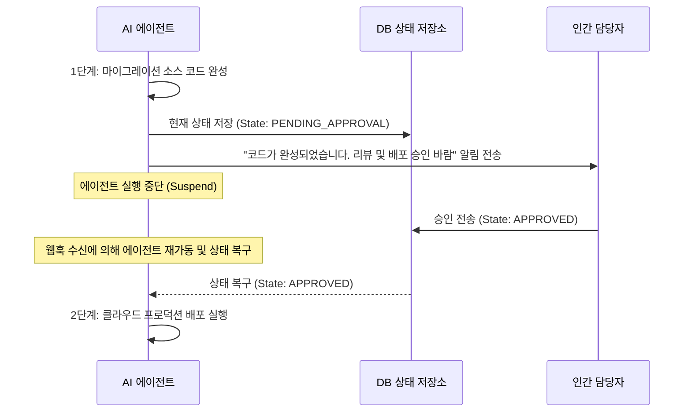

# 장기 실행 AI 에이전트를 구축하기 위한 3가지 패턴 (3 patterns to build long-running AI agents)

## 개요
- **핵심 개념 요약**: 장기 실행(Long-running) 에이전트를 안정적이고 통제 가능하게 빌드하기 위해 널리 활용되는 3대 핵심 아키텍처 디자인 패턴인 Human-in-the-Loop, State Hydration/Resume, 그리고 Event-driven Loop의 동작 구조와 트레이드오프를 상세히 학습합니다.
- **업로드일**: 2026-06-18
- **YouTube 링크**: [Watch Video](https://www.youtube.com/watch?v=l6KeLCuB90o)

## 내용
### Pattern 1: Human-in-the-Loop (인간 승인 피드백 루프)
- **작동 방식**: 민감한 도구를 호출하거나 비용이 크게 유발되는 최종 의사결정 단계 직전에 에이전트 루프가 동작을 **대기(Suspend)**하고, 인간 담당자에게 이메일이나 Slack 등으로 승인 요청을 전송합니다. 사용자가 승인(`Approve`/`Reject`)을 반환하면 대기하고 있던 상태를 복구하여 이어서 실행합니다.
- **용도**: 프로덕션 배포 결재, 대형 자금 인출 승인 등.

### Pattern 2: State Hydration & Resume (상태 영속성 패턴)
- **작동 방식**: 상태(State) 구조체를 독립적인 계층으로 정의하고, 에이전트의 실행 노드가 전환될 때마다 데이터베이스에 JSON이나 바이너리 데이터로 체크포인트를 영구 저장합니다. 임의 시점에 인프라가 강제 리셋되어도 마지막 저장 데이터로 상태를 주입(Hydration)해 재개할 수 있습니다.
- **용도**: 장기 리서치 배치 작업, 주기적인 파이프라인 관리.

### Pattern 3: Event-driven Loop (이벤트 기반 비동기 루프)
- **작동 방식**: 에이전트가 CPU 연산을 점유하며 계속 대기 상태로 루프를 도는 대신, 메시지 큐(예: GCP Pub/Sub, RabbitMQ)나 웹훅(Webhook) 이벤트를 수신할 때만 트리거되어 1단계 작업을 처리하고 상태를 저장한 뒤 바로 절전 모드(Zero scale)로 돌아갑니다.
- **용도**: 이벤트 알림 대기, 비동기 실시간 고객 상호작용.

## 예시
아래 다이어그램과 Python 예제는 Human-in-the-Loop 패턴의 중간 승인 프로세스 흐름을 묘사합니다.



### Human-in-the-Loop 승인 대기 코드 예시
```python
from google_cloud_adk import Agent, State

class ApprovalState(State):
    proposal_text: str = ""
    is_approved: bool = False
    status: str = "INIT"  # INIT, PENDING, APPROVED, REJECTED

class ApprovalAgentWorkflow:
    def __init__(self):
        self.writer = Agent(name="ProposalWriter", instructions="기획안을 작성하세요.")
        self.executor = Agent(name="Deployer", instructions="기획을 실행하세요.")

    def run_step_1(self, state: ApprovalState) -> ApprovalState:
        state.proposal_text = self.writer.run("신규 클라우드 보안 정책 수립").content
        state.status = "PENDING"
        # 여기서 실행을 멈추고 외부 이벤트(인간 승인)를 기다리도록 상태 반환
        print("[Workflow] Step 1 finished. Waiting for Human approval...")
        return state

    def run_step_2(self, state: ApprovalState) -> ApprovalState:
        if state.status == "APPROVED" and state.is_approved:
            print("[Workflow] Step 2 execution: Deploying security policy...")
            self.executor.run(f"Deploy plan: {state.proposal_text}")
            state.status = "COMPLETED"
        else:
            print("[Workflow] Step 2 skipped. Status is not approved.")
        return state
```

## 요약
- 무한 대기하는 무거운 프로세스를 유지하는 것보다 Event-driven 및 State Hydration 패턴을 결합하여 비용을 최적화하는 서버리스 아키텍처 방식이 모던 에이전트 개발의 표준입니다.
- Human-in-the-Loop 패턴은 완전 자율 에이전트의 위험성을 통제하고 비즈니스 안정성을 보장해 주는 필수적인 안전 밸브입니다.
- 인프라 중단 상태에 대응하기 위한 상태 영속화(State Hydration) 처리가 밑바탕에 구현되어 있어야 세 가지 패턴 모두가 유기적으로 정상 동작할 수 있습니다.
