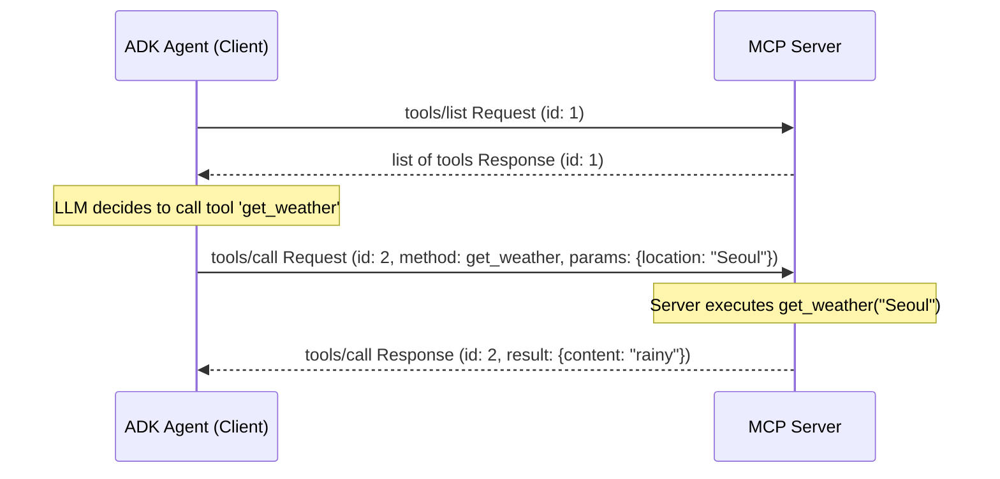

# Model Context Protocol(MCP)의 실제 작동 원리 (How Model Context Protocol (MCP) actually works)

## 개요
- **핵심 개념 요약**: Model Context Protocol (MCP)의 하위 통신 레이어와 프로토콜 규격 스펙을 해부합니다. 클라이언트와 서버 간의 JSON-RPC 2.0 기반 상호작용 방식, StdIO(표준 입출력) 및 SSE(Server-Sent Events) 전송 방식의 상세 동작 흐름을 이해합니다.
- **업로드일**: 2026-06-24
- **YouTube 링크**: [Watch Video](https://www.youtube.com/watch?v=cGuyrANVi4A)

## 내용
### 1. 통신 기반: JSON-RPC 2.0
- MCP의 모든 교환 데이터는 JSON-RPC 2.0 표준 형식을 준수합니다.
- 요청(Request), 응답(Response), 알림(Notification) 세 가지 패킷 유형이 사용되며, 각 패킷에는 고유한 `id`와 실행할 `method`, 매개변수 `params`가 들어갑니다.

### 2. 양방향 프로토콜 레이어 (Protocol Layers)
- **Handshake (핸드셰이크)**: 연결 초기화 단계에서 클라이언트와 서버가 서로를 확인하고 지원 스펙 및 버전을 협상합니다 (`initialize` 메소드).
- **Capabilities (기능 정의)**: 서버는 자신이 제공할 수 있는 세부 역량(Prompts, Resources, Tools)을 공유합니다.
- **Request-Response (요청-응답 루프)**: 클라이언트가 도구 실행(`tools/call`)을 요청하면 서버는 해당 기능을 구동해 결과를 돌려줍니다.

### 3. 두 가지 주요 전송 방식 (Transports)
- **StdIO (Standard Input/Output)**: 로컬 상에서 부모 프로세스(클라이언트 IDE/에이전트)가 자식 프로세스(MCP 서버)를 포크(Fork)하여 표준 입력과 표준 출력 파이프라인으로 텍스트 데이터를 교환합니다. 지연 시간이 극단적으로 낮아 로컬 최적화에 유리합니다.
- **SSE (Server-Sent Events)**: 네트워크 상에서 통신할 때 사용됩니다. 클라이언트는 POST 요청으로 서버에 쓰기(Write) 작업을 보내고, 서버는 HTTP SSE 스트림 채널을 개시하여 클라이언트에 지속해서 데이터 이벤트를 내려보냅니다(Read).

## 예시
아래 다이어그램과 JSON 예제는 클라이언트가 MCP 서버에 특정 도구 호출(`tools/call`)을 지시할 때 교환되는 메시지의 구조입니다.



### JSON-RPC 2.0 요청 페이로드 예시
```json
{
  "jsonrpc": "2.0",
  "method": "tools/call",
  "params": {
    "name": "get_weather",
    "arguments": {
      "location": "Seoul"
    }
  },
  "id": 2
}
```

## 요약
- MCP는 복잡하고 일관되지 않았던 플러그인 생태계를 JSON-RPC 규격을 통해 단일한 아키텍처 모델로 통일시켰습니다.
- 로컬 환경에서는 개발이 간단하고 안정적인 StdIO 전송 방식이 널리 쓰이며, 원격 또는 컨테이너 배포 시에는 HTTP/SSE 방식이 사용됩니다.
- 프로토콜 규격 수준에서 오류 리포팅과 초기 연결 프로세스를 명확히 정의하고 있어 예외 복구(Error recovery)가 한결 부드럽습니다.
