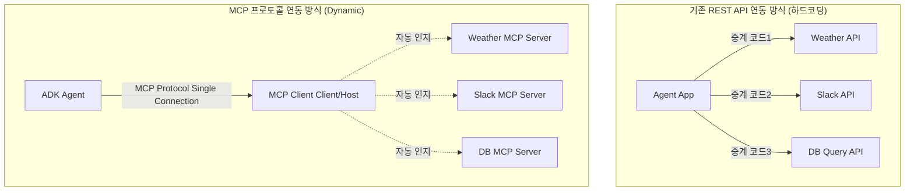

# MCP 대 API: 기존 API가 AI 에이전트 구축에 한계를 보이는 이유 (MCP vs API: Why traditional APIs are failing AI agents)

## 개요
- **핵심 개념 요약**: 기존의 REST/GraphQL API 아키텍처가 에이전틱(Agentic) AI 시스템 환경에서 직면하는 한계점들을 도출하고, 이를 극복하기 위해 Model Context Protocol (MCP) 표준 프로토콜이 제시하는 메타데이터 스키마 및 컨텍스트 중심 설계의 강점을 대조 분석합니다.
- **업로드일**: 2026-07-01
- **YouTube 링크**: [Watch Video](https://www.youtube.com/watch?v=185XGEMefgc)

## 내용
### 1. 전통적인 REST API의 에이전틱 한계
- **불규칙한 스키마**: 각 API 서비스마다 엔드포인트명, 요청 헤더, 에러 구조가 상이하여 LLM이 이를 인지하기 위해 수많은 프롬프트 토큰과 복잡한 중계 함수 코드를 하드코딩해야 합니다.
- **Context Overload (콘텍스트 과부하)**: 일반 API 응답에는 LLM에 불필요한 메타데이터와 HTML 마크업, 포맷 정보가 섞여 있어 토큰을 크게 낭비시킵니다.
- **정적 바인딩**: 컴파일 시점에 도구 정의가 고정되어, 에이전트 구동 중에 동적으로 새로운 데이터 소스나 도구를 추가하기 어렵습니다.

### 2. MCP가 해결하는 문제
- **표준 메타데이터 인터페이스**: 도구와 리소스의 명세 양식을 `tools/list` 와 같이 단일한 구조로 표준화하여 LLM이 도구의 기능을 즉각적이고 정확하게 인지하게 만듭니다.
- **Context-aware Filtering (맥락 최적화)**: 에이전트 클라이언트가 이해하기 좋은 형태의 순수 데이터 구조(ToolResult)만 필터링하여 응답하므로 토큰 사용량과 지연 시간을 최소화합니다.
- **동적 바인딩(Dynamic Binding)**: 에이전트 코드의 변경 없이 원격지의 MCP 서버 연결만 추가하면 즉시 새로운 능력을 에이전트 시스템에 탑재할 수 있습니다.

### 3. 비교 분석 요약
| 비교 항목 | 전통적 REST API | Model Context Protocol (MCP) |
| :--- | :--- | :--- |
| **타깃 대상** | 웹/앱 클라이언트, 일반 소프트웨어 | 대형 언어 모델 (LLM) 및 AI 에이전트 |
| **통신 규격** | REST, GraphQL, gRPC (파편화됨) | JSON-RPC 2.0 (단일 표준) |
| **통합 유연성** | 코드 레벨 하드코딩 및 라우팅 필요 | 프로토콜 수준 동적 검색 및 즉각 사용 |
| **콘텍스트 효율** | 불필요한 필드로 인해 토큰 낭비 심함 | LLM 최적화 순수 텍스트/미디어 반환 |

## 예시
아래 개념 다이어그램은 API 직접 매핑 구조와 MCP 기반의 플러그앤플레이(Plug-and-Play) 연동 구조의 차이를 시각적으로 묘사합니다.

## 요약
- 전통적인 REST API는 인간 개발자나 일반 애플리케이션을 위해 설계된 반면, MCP는 LLM 두뇌와 에이전트 클라이언트를 주 대상으로 설계된 맞춤형 상호작용 표준입니다.
- MCP를 채택하면 파편화된 인터페이스 중계 레이어를 제거할 수 있어, 에이전트 소스 코드가 가벼워지고 유지보수 편의성이 비약적으로 증가합니다.
- 동적 바인딩 메커니즘 덕분에 에이전트 시스템 전체의 확장성과 유연성이 대폭 향상됩니다.
