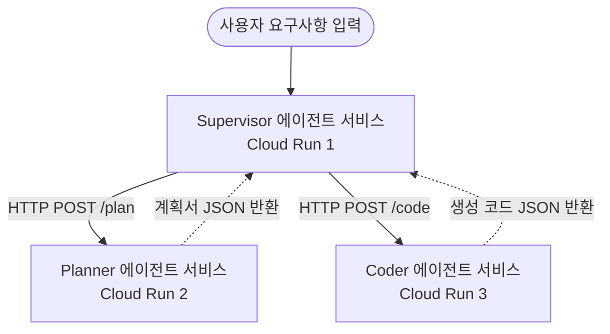

# 다중 에이전트 시스템 아키텍처 설계 (Architecting multi-agent systems)

## 개요
- **핵심 개념 요약**: 단일 가상머신 내부에서 동작하던 모놀리식 에이전트를 벗어나, 대형 클라우드 분산 네트워크 망에서 각 역할을 맡은 독립 에이전트들을 마이크로서비스(Microservices) 형태로 파편화하여 유기적으로 연동하는 **분산형 다중 에이전트(Distributed Multi-agent)** 아키텍처의 설계 이론을 확립합니다.
- **업로드일**: 2026-01-06
- **YouTube 링크**: [Watch Video](https://www.youtube.com/watch?v=j_l-9uNX2SA)

## 내용
### 1. 분산형 다중 에이전트 시스템의 필연성
- 기획, 코딩, 테스트, 인프라 배포 등 모든 기능을 가진 거대 에이전트를 구성하면, 에이전트 크기가 거대해져 업데이트가 힘들고 하나의 기능 장애가 전체 시스템 중단으로 이어집니다.
- 에이전트 단위를 독립된 컨테이너 API 서비스로 분할 배포하면, 특정 에이전트(예: Coder 에이전트)만 개별적으로 리팩토링하고 자원(CPU/GPU)을 필요에 맞게 차등 할당(Scale)할 수 있습니다.

### 2. 마이크로서비스 에이전트 간의 데이터 전달 표준
- 각 에이전트는 독립된 주소(Endpoint URI)를 가지며, REST API(HTTP/JSON)나 고성능 저지연 통신용 gRPC 채널을 통해 구조화된 데이터 메시지를 주고받습니다.
- 전체 프로세스를 관리하는 최상위 **Supervisor(감독자) 에이전트**가 오케스트레이터 허브 역할을 전담합니다.

## 예시
아래 다이어그램과 파이썬 예시는 Supervisor 에이전트가 네트워크 상에 독립 배포된 `PlanningService` 및 `CodingService` API 엔드포인트 에이전트를 호출하여 순차적인 자율 과업을 수행하는 분산 다중 에이전트 연동 아키텍처 구조의 예시입니다.



### 분산 에이전트 게이트웨이 파이썬 구현 예시
```python
import requests
import os

PLANNER_SERVICE_URL = os.environ.get("PLANNER_SERVICE_URL", "https://planner-agent-abc.run.app")
CODER_SERVICE_URL = os.environ.get("CODER_SERVICE_URL", "https://coder-agent-abc.run.app")

class DistributedSupervisor:
    def execute_lifecycle(self, user_goal: str) -> str:
        print(f"[Supervisor] 1단계: Planner 에이전트에 업무 정의 요청...")
        # 1. 원격 플래너 에이전트 마이크로서비스 호출
        plan_response = requests.post(f"{PLANNER_SERVICE_URL}/plan", json={"goal": user_goal})
        plan_data = plan_response.json()["plan"]
        print("[Supervisor] 계획 수립 완료. 2단계: Coder 에이전트에 코드 생성 요청...")
        
        # 2. 원격 코더 에이전트 마이크로서비스 호출
        code_response = requests.post(f"{CODER_SERVICE_URL}/code", json={"plan": plan_data})
        final_code = code_response.json()["code"]
        
        print("[Supervisor] 최종 개발 완성본 도출 성공.")
        return final_code
```

## 요약
- 엔터프라이즈 시스템 구축 시 에이전트 컴포넌트를 **마이크로서비스로 분할 배포**하여 독립성과 장애 격리(Fault isolation)를 확보하는 설계가 분산 아키텍처의 필수 조건입니다.
- 분산형 설계는 단일 에이전트 가동 시 발생하는 메모리 한계점과 콘텍스트 과부하 현상을 말끔히 해소합니다.
- 복잡하게 분산된 에이전트들의 정상 작동 유무를 판단하기 위해, 에이전트 서비스 전반의 분산 로그 추적 도구(구글 Cloud Trace 등)를 통합 매핑해 두어야 디버깅이 수월해집니다.
